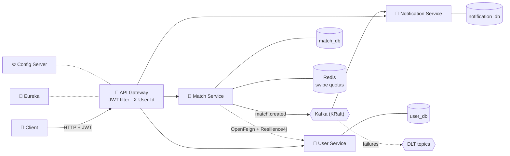

<!-- ===================== HEADER ===================== -->

 

---

## 👨‍💻 About Me

I'm a **Java Backend Engineer** who builds scalable REST APIs and event-driven microservices with **Spring Boot, Spring Cloud and Apache Kafka**. I care about systems that stay **correct under failure**: retries, duplicate messages, slow dependencies and race conditions.

With a **Microsoft Security Operations Analyst (SC-200)** and **CEH** background, I design backends with security built in, not bolted on.

- 🏢 **Associate Software Engineer** at **LTM**, Hyderabad
- 💘 Currently building: **SoftLaunch**, a Spring Boot 4 microservices dating platform
- 🌱 Exploring next: **gRPC, WebSockets, Redis GEO and observability**
- 🎓 **KL University** alumnus
- 💬 Ask me about: **Spring Boot, Kafka, microservices, API security, CI/CD**

 

---

## 🧰 Tech Stack

<table>
  <tr>
    <td align="center" width="110"> <b>Java</b></td>
    <td align="center" width="110"> <b>Spring Boot</b></td>
    <td align="center" width="110"> <b>Hibernate</b></td>
    <td align="center" width="110"> <b>Maven</b></td>
    <td align="center" width="110"> <b>Apache Kafka</b></td>
    <td align="center" width="110"> <b>React</b></td>
  </tr>
  <tr>
    <td align="center" width="110"> <b>PostgreSQL</b></td>
    <td align="center" width="110"> <b>MySQL</b></td>
    <td align="center" width="110"> <b>MongoDB</b></td>
    <td align="center" width="110"> <b>Redis</b></td>
    <td align="center" width="110"> <b>Docker</b></td>
    <td align="center" width="110"> <b>AWS</b></td>
  </tr>
  <tr>
    <td align="center" width="110"> <b>GitHub Actions</b></td>
    <td align="center" width="110"> <b>Git</b></td>
    <td align="center" width="110"> <b>GitHub</b></td>
    <td align="center" width="110"> <b>Postman</b></td>
    <td align="center" width="110"> <b>Linux</b></td>
    <td align="center" width="110"> <b>Microsoft Azure</b></td>
  </tr>
</table>

 

| Category | Technologies |
|:--|:--|
| ☕ **Languages** |    |
| 🌱 **Backend** |      |
| 🧩 **Distributed Systems** |      |
| 🗄️ **Data** |     |
| 🔐 **Security** |        |
| ☁️ **DevOps & Tools** |       |

---

## 💼 Experience

### 🏢 Associate Software Engineer · **LTM**
📅 *Feb 2026 – Present* &nbsp;|&nbsp; 📍 *Hyderabad, Telangana*

- 🔧 Develop and maintain backend features and **REST APIs** with **Java and Spring Boot**
- 💘 Building **SoftLaunch**, a microservices product prototype
- 🐞 Write SQL, **debug application issues, analyze logs** and troubleshoot
- 🤝 Take part in **code reviews**, stand-ups and sprint work using Git and Postman

### 🎓 Java Full Stack Trainee · **Student Tribe**
📅 *Jan 2025 – Oct 2025* &nbsp;|&nbsp; 📍 *Hyderabad, Telangana*

- 🧱 Built backend modules from design to deployment with **Spring Boot, Spring Data JPA, Hibernate and MySQL**
- 🔐 Developed and tested REST APIs for **authentication, exception handling and layered architecture**
- ✅ Applied OOP, Git workflows and clean-code standards, and took part in peer code reviews

---

## 🌟 Spotlight: [SoftLaunch](https://github.com/Nayeemshaik29/softlaunch) 💘

> **A cloud-native dating platform built as Spring Boot 4 microservices: sign up, build a rich profile, swipe, match and get notified in real time.**

### 🏗️ Architecture

### ⚙️ Engineering Highlights

| Area | What I built | Why it matters |
|:--|:--|:--|
| 🔐 **Gateway security** | Global JWT filter that forwards `X-User-Id` and **strips client-supplied headers** | Stops identity spoofing; `/internal/**` routes are never exposed |
| ⏱️ **Auth hardening** | **Constant-time login** with a dummy hash check for unknown emails | Blocks timing-based user enumeration |
| 💞 **Race-safe matching** | Matches stored as a **sorted user pair** with a unique DB constraint | A↔B and B↔A can never create duplicate matches |
| 🚦 **Rate limiting** | **Redis `INCR` + TTL** daily swipe quota | Returns `429` when the quota runs out, and scales across instances |
| 🛡️ **Fault tolerance** | **OpenFeign + Resilience4j** circuit breaker and time limiter | Match Service keeps working when User Service is slow |
| 📨 **Event-driven** | Kafka `match.created` events with **idempotent consumers, retries and DLT** | No lost or duplicate notifications |
| 🧾 **Clean APIs** | **RFC 9457 `ProblemDetail`** errors, Bean Validation, a custom `@Adult` validator | Consistent errors and 18+ enforcement at the edge |
| 🗃️ **Data ownership** | **Database per service** (PostgreSQL 17) | Services stay independent and deploy separately |

### 🗺️ Roadmap

| Phase | Scope | Status |
|:--:|:--|:--:|
| 1 | Eureka, Config Server, API Gateway | ✅ |
| 2 | User Service: signup/login, BCrypt, JWT, rich profiles | ✅ |
| 3 | Gateway security: JWT filter, header anti-spoofing | ✅ |
| 4 | Match Service: swipes, matching, Redis quota, Feign + circuit breaker | ✅ |
| 5 | Kafka events, Notification Service, idempotency, retries + DLT | ✅ |
| 6 | Discovery: Redis GEO nearby feed + gRPC | 📋 |
| 7 | Chat: WebSocket/STOMP, MongoDB, disappearing messages | 📋 |
| 8 | Verification (18+ KYC mock) and safety (report/block) | 📋 |
| 9 | Observability: Zipkin, Prometheus, Grafana | 📋 |
| 10 | AI assistant: openers and scam detection (Ollama + pgvector) | 📋 |

---

## 🏆 More Projects

<table>
<tr>
<td width="50%" valign="top">

### 🚀 [Skillora](https://github.com/Nayeemshaik29/Skillora)
**Professional networking platform**

- 🧩 **6 microservices** with Gateway, Eureka and JWT, handling **1,000+ req/min**
- ⚡ Kafka at **5,000 events/sec**, cutting notification latency from **3s to 500ms**
- 🔭 **Resilience4j, Zipkin and ELK** for observability
- 🗃️ Database-per-service design

</td>
<td width="50%" valign="top">

### 🏨 [BookingBlock](https://github.com/Nayeemshaik29/BookingBlock)
**Hotel booking platform**

- 🌐 **8 REST APIs** serving **100+ listings** in **under 150ms**
- 💳 Stripe integration with **200+ transactions** at a **99.5% success rate**
- 🎨 **Decorator pattern** for dynamic pricing
- 🧠 Hibernate caching that cuts **DB calls by 50%**

</td>
</tr>
<tr>
<td width="50%" valign="top">

### ⚙️ [CI/CD Playground](https://github.com/Nayeemshaik29/ci-cd-playground)
**Automated Spring Boot deployment**

- 🔁 Goes from `git push` to a **live container on EC2** with no manual steps
- 🏗️ Maven → **multi-arch Buildx (arm64)** → Docker Hub → SSH deploy
- 🛠️ Fixed an **x86_64 vs ARM64 Graviton** mismatch and other pipeline bugs

</td>
<td width="50%" valign="top">

### 💸 [CredResolve](https://github.com/Nayeemshaik29/CredResolve-Assignment)
**Expense-sharing backend**

- 👥 Users, groups and **expense splitting**
- 🧮 **Balance calculation** across group members
- 🧱 Clean **layered architecture**

</td>
</tr>
</table>

<b>📚 Learning and reference repos (click to expand)</b>

 

| Repo | What's inside |
|:--|:--|
| 🗃️ [Database-Optimization](https://github.com/Nayeemshaik29/Database-Optimization) | 18 techniques (indexing, partitioning, sharding, replication) with diagrams |
| 🧠 [Interview-DSA-Playbook](https://github.com/Nayeemshaik29/Interview-DSA-Playbook) | Pattern-based Java DSA prep with dry runs and complexity analysis |
| 🎨 [Design_Patterns](https://github.com/Nayeemshaik29/Design_Patterns) | Design patterns in Java using real-world scenarios |
| 📨 [kafka-learning-spring-boot](https://github.com/Nayeemshaik29/kafka-learning-spring-boot) | Kafka producer and consumer exchanging location events |
| 🧱 [object-oriented-programming](https://github.com/Nayeemshaik29/object-oriented-programming) | OOP guide from beginner to expert, interview-focused |

---

## 🏅 Certifications

 

 

---

## 📊 GitHub Activity

### 🧠 LeetCode

---

## 🤝 Let's Connect

💡 *Open to **Java backend engineering** roles and collaboration on **microservices, event-driven and secure systems**.*

